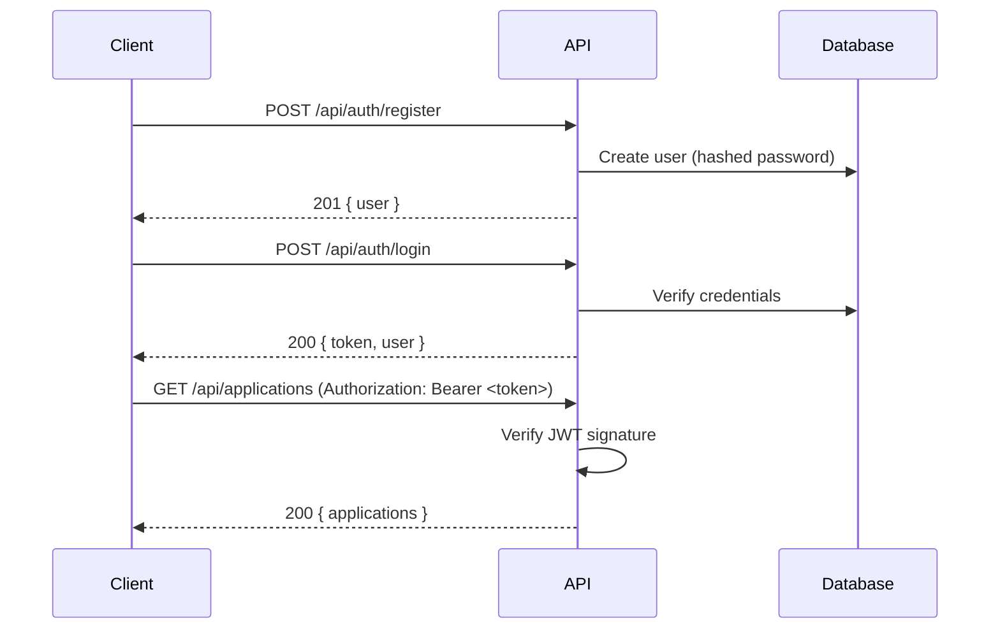

## Overview

All protected endpoints require a valid JWT passed in the `Authorization` header:

```
Authorization: Bearer <your-token>
```

Tokens are issued on login and expire based on the `JWT_EXPIRES_IN` environment variable (default: `7d`).

## Auth Flow



## Token Payload

The JWT payload contains:

```json
{
  "userId": "uuid",
  "email": "user@example.com",
  "name": "Jane Doe",
  "iat": 1719273600,
  "exp": 1719878400
}
```

This payload is available on `req.user` in all protected route handlers.

## Security Notes

<Warning>
  Never expose your `JWT_SECRET` in client-side code or version control. Use environment variables and rotate the secret if it's ever compromised — this will invalidate all existing tokens.
</Warning>

- Passwords are hashed with **bcrypt** (10 salt rounds) before storage
- The API uses **consistent error messages** for wrong email/password (to prevent email enumeration)
- A stricter rate limit applies to auth routes: **10 requests per 15 minutes per IP**

## Error Responses

| Status | Meaning |
|---|---|
| `400` | Validation error (missing or malformed fields) |
| `401` | Invalid/expired token or wrong credentials |
| `409` | Email already registered |
