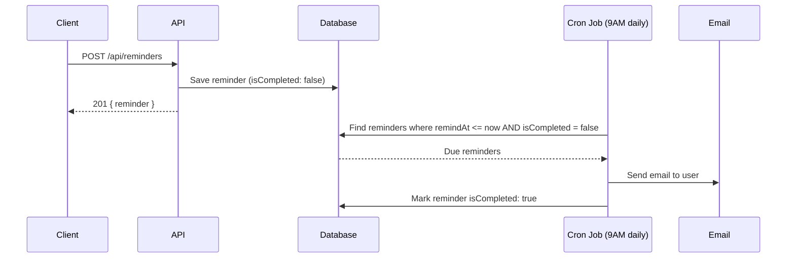

## Overview

Reminders let you schedule time-based notifications for any application — follow-ups, interview prep deadlines, offer deadlines, etc.

Each reminder is linked to an application and fires an email to the user on the scheduled date.

## How Reminders Work



## Cron Schedule

The reminder job runs **every day at 9:00 AM** server time. Reminders are sent if their `remindAt` timestamp is at or before the current time.

<Note>
  Reminders are not real-time. If you create a reminder for 2:00 PM, it will be sent the following morning at 9:00 AM the next day the cron runs after the `remindAt` time passes.
</Note>

## Email Format

The reminder email includes:

- The reminder message
- Company name and role
- Current application status

```
Subject: Reminder: Follow up on application

Hi Jane,

Follow up on the Senior Engineer application

• Company: Acme Corp
• Role: Senior Engineer
• Status: INTERVIEW

Good luck! 🚀
```

## Reminder Statuses

| Field | Description |
|---|---|
| `isCompleted: false` | Reminder is pending, not yet sent |
| `isCompleted: true` | Email has been sent |

You can manually mark a reminder as complete by `PATCH /api/reminders/:id` with `{ "isCompleted": true }`.

## Validation Rules

- `remindAt` must be a **future date/time**
- `message` is required, max 500 characters
- `applicationId` must reference an application owned by you

## Authorization

You can only view, update, and delete reminders tied to **your own** applications. Attempts to access another user's reminders will return `403 Forbidden`.
